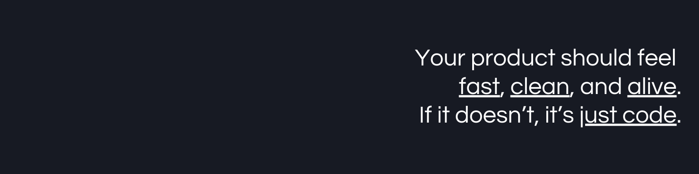

  

<h1 align="center">Olá, eu sou o Eliseu! 👋</h1>

  
  
  
  
  
  
  

  

  

---

### 👨‍💻 Sobre Mim

Sou um **Desenvolvedor Full Stack** com mais de **10 anos de experiência**, especializado em **MicroFrontends**, **arquitetura de sistemas** e soluções digitais de **alto desempenho**. Tenho paixão por:

- **Frontend:** ReactJS, Angular, VueJS, SingleSPA
- **Backend:** Node.js (NestJS, Express), PHP (Laravel, Symfony, CodeIgniter), Python, Java (Spring)
- **Infraestrutura:** AWS, Kubernetes, Docker, Terraform, GitHub Actions
- **Blockchain:** Desenvolvimento de soluções em Bitcoin, Ethereum, SmartContracts

🎸 Além de tecnologia, sou músico nas horas vagas (teclado, guitarra, baixo, bateria e melódica), apaixonado por inovação, automação residencial, elétrica e CFTV.

🚀 Atualmente focado em projetos próprios, inovação em MicroFrontends e explorando inteligência artificial aplicada a plataformas SaaS.

💬 **Me pergunte sobre:** Arquitetura de Software, MicroFrontends, APIs, Cloud, Sistemas Distribuídos, Blockchain, DevOps, Design Patterns e Segurança.

📫 **Onde me encontrar:** Nos links acima ☝️ ou no meu [site pessoal](https://eliseu.dev/).

⚡ **Curiosidade:** Amo Programação, Criptomoedas (especialmente BTC), Inovação e Música.

---

### 🛠️ Tecnologias e Ferramentas

  

---

### 📈 Minhas Estatísticas

  
  
  

  

---

### 🧠 Métricas de Desenvolvimento

  

---

### 🏆 Troféus do GitHub

  

---

> **Nota:** *As linguagens mostradas são baseadas nos projetos públicos do GitHub.*
